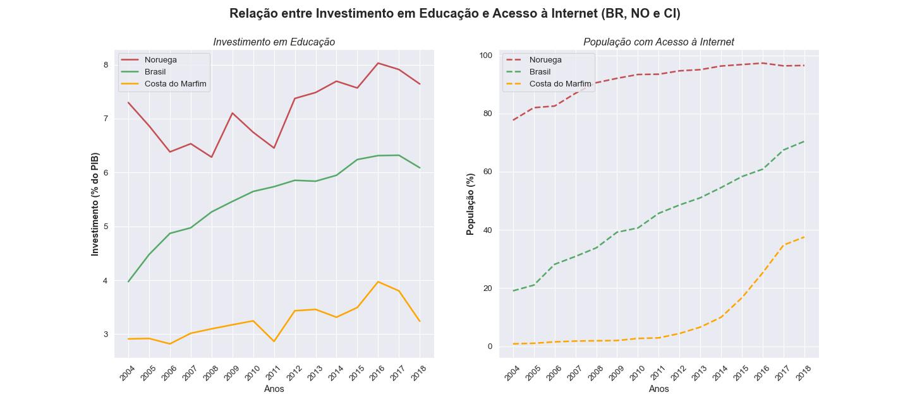

# APS - Cdados - 2022.2 - Insper  
Atividade Prática Supervisionada da Disciplina de Ciência de Dados do curso de Ciência da Computação do Insper. 
## Integrantes
* Eduardo Mendes Vaz - eduardov1  
* João Lucas de Moraes Barros Cadorniga - joaolmbc

---

## Observação

Para a entrega da APS3, o texto havia ficado muito grande, então foi diminuido para caber no limite de palavras. No entanto, **alguns bits de informações que podem ser interessantes foram colocados como extras ao longo do cálculos das probabilidades/modelo**. Caso queira saber mais sobre, está mais do que convidade a ler :)

---

## Ordem das informações

1. Texto de análise
2. Cálculos e Modelos
3. Informações extras
4. Gráfico de distribuição dos países classificados nos blocos
5. Atualizações de feedback da APS2  
  
---
  
## APS2 corrigida com Feedback

